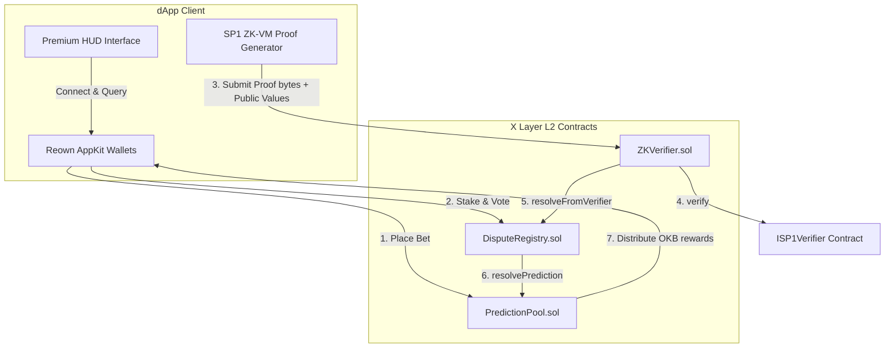

# ZK-VAR // Zero-Knowledge Video Assistant Referee

> **World Cup-themed Sovereign Referee Arena & Decentralized Sports Predictions on X Layer**
> 
> A World Cup-themed decentralized prediction market and dispute resolution engine. Outcomes are resolved through a two-stage mechanism: a decentralized crowd-sourced jury tribunal and a Zero-Knowledge-verifiable AI Referee (SP1 ZK-VM) executing on-chain proofs.

---

## 🏆 X Cup Alignment

ZK-VAR is built for the **Build X Hackathon: X Cup** as a World Cup-themed project on X Layer.

* **Theme:** World Cup VAR moments, disputed goals, offside calls, penalty reviews, touchline disputes, and fan debate.
* **Track fit:** Prediction markets, AI/ZK referee flow, social/fan jury participation.
* **X Layer deployment:** PredictionPool, DisputeRegistry, and ZKVerifier are deployed on X Layer Testnet.
* **Dedicated X account:** [@TheZkVar](https://x.com/TheZkVar)
* **Builder:** [@Datweb3guy](https://x.com/Datweb3guy)

The public app now focuses on World Cup-style markets. Non-X Cup markets can be cancelled from the owner-only Admin console so affected users can claim refunds.

---

## ⚽ The Problem & The ZK-VAR Innovation

Controversial refereeing decisions—like contested offsides, touchline exits, and penalties—frequently decide match outcomes. Traditional sports prediction markets rely on centralized third-party data oracles. These oracle APIs suffer from latency, single-point failures, and lack of accountability, leaving prediction outcomes subject to dispute or manipulation.

**ZK-VAR** introduces a trustless, transparent model for resolving contentious sports events:
1. **Decentralized Fan Jury Tribunal:** Fans stake native `OKB` to vote on active disputes, establishing a weighted consensus.
2. **ZK-VM Proof Settlement:** A deterministic referee algorithm analyses game parameters (e.g. spatial coordinates of players and the ball). It generates a cryptographic proof in the **Succinct SP1 ZK-VM**. The proof is verified on-chain via a verifier contract to settle the dispute with mathematical finality, overriding/finalizing the prediction pools.

---

## 🛠️ Deployed Smart Contracts (X Layer Testnet)

All smart contracts are fully open-source, compiled, and deployed on the **X Layer Testnet (Chain ID: 1952)** using native `OKB` tokens.

| Contract Name | Deployed Address | Explorer Link |
| :--- | :--- | :--- |
| **PredictionPool.sol** | `0x1cFa3a209a85BC7E5731bf160E8E1826A6f7727F` | [View on OKLink](https://www.okx.com/web3/explorer/xlayer-test/address/0x1cFa3a209a85BC7E5731bf160E8E1826A6f7727F) |
| **DisputeRegistry.sol**| `0x1F9a7E49D0339A53e47857D0D032121764058eF7` | [View on OKLink](https://www.okx.com/web3/explorer/xlayer-test/address/0x1F9a7E49D0339A53e47857D0D032121764058eF7) |
| **ZKVerifier.sol**     | `0x5506A30112A86aEBAAD9bbF2093A4E36eFf89296` | [View on OKLink](https://www.okx.com/web3/explorer/xlayer-test/address/0x5506A30112A86aEBAAD9bbF2093A4E36eFf89296) |

---

## 📐 System Architecture



### 1. PredictionPool.sol
Handles prediction pool lifecycle (Creation, Betting, Resolution, Payout Claims, and Refund Claims). 
* Users bet on outcomes `1 (Yes)` or `2 (No)` by sending native `OKB` to `placePrediction()`.
* Resolution is locked until the `DisputeRegistry` contract provides the authoritative referee verdict.

### Transaction History
The interface includes two transaction history views:
* **My Wallet:** wallet-scoped activity for the connected address, including dApp-submitted transactions and matching on-chain stake/claim events.
* **Market Feed:** public on-chain prediction and jury stake events scanned from X Layer logs, with direct OKX Explorer links.

The X Layer testnet RPC limits `eth_getLogs` ranges to 100 blocks, so history is fetched in small chunks. Tune `VITE_HISTORY_LOOKBACK_BLOCKS` if you need a wider or faster public feed.

### 2. DisputeRegistry.sol
Manages tribunals for controversial match plays. 
* Fans stake `OKB` to back their vote choices: `Valid`, `Invalid`, or `Inconclusive`.
* Winning voters receive their proportional share of the losing stakes via `claimJuryRewards()`.
* The `resolveFromVerifier()` interface allows an authorized `ZKVerifier` contract to settle the dispute instantly, overriding the tribunal.

### 3. ZKVerifier.sol
Receives SP1 verification proofs.
* Validates that the guest program public output parameters match the play details.
* Interacts with Succinct's standard `ISP1Verifier` system contract deployed on X Layer to verify proofs.
* In the current app UI, proof submission is restricted to the contract owner/oracle wallet. For mainnet, the Solidity verifier should also enforce this with an owner or oracle role.

---

## ⚡ Wallet Transaction Model

ZK-VAR uses real wallet-signed transactions through Reown AppKit + wagmi. Prediction stakes, jury votes, proof submissions, and claims are sent by the connected wallet, so the wallet address remains the on-chain `msg.sender` and native `OKB` is deducted from the actual user account.

The connection modal supports MetaMask, WalletConnect mobile wallets, Coinbase Wallet, Rabby, and other injected wallets. MetaMask/WalletConnect are recommended for live demos on X Layer Testnet. OKX Wallet can connect, but its testnet pre-broadcast simulator may reject valid contract writes before showing a signature prompt.

---

## ⚙️ Local Setup & Run Guide

### 1. Prerequisites
Ensure you have the following installed:
* **Node.js** (v20+ recommended)
* **Foundry** (for solidity tests and deployment scripts)

### 2. Clone & Install Dependencies
```bash
git clone https://github.com/Datwebguy/zk-var.git
cd zk-var
npm install
```

### 3. Configure Local Environment
Create a `.env` file in the root directory:
```env
PRIVATE_KEY=your_deployer_private_key_here
RPC_URL=https://testrpc.xlayer.tech/terigon
RPC_FALLBACK_URL=https://xlayertestrpc.okx.com/terigon
VITE_REOWN_PROJECT_ID=your_reown_project_id_here

# Optional history scan tuning for the deployed contracts
VITE_HISTORY_START_BLOCK=30819655
VITE_HISTORY_LOOKBACK_BLOCKS=1000
```
*(The local `.env` is ignored by git to keep your private key secure.)*

### 4. X Layer Testnet Wallet Settings
If your wallet asks you to add the network manually, use the official X Layer testnet details:

```text
Network name: X Layer Testnet
Chain ID: 1952
Currency symbol: OKB
RPC URL: https://testrpc.xlayer.tech/terigon
Fallback RPC URL: https://xlayertestrpc.okx.com/terigon
Block explorer: https://www.okx.com/web3/explorer/xlayer-test
```

If a wallet shows `invalid chain ID`, remove any old custom X Layer network using chain ID `195` and re-add it with chain ID `1952`.

### 5. Running the Development Server
```bash
npm run dev
```
Open `http://localhost:3000` to interact with the ZK-VAR interface.

### 6. Smart Contract Tests (Foundry)
Execute the contract test suite:
```bash
forge test
```

---

## 👁️ Walkthrough Guide (Step-by-Step Flow)

Follow these steps to experience the complete live on-chain lifecycle:

### Step 1: Connect your Wallet
Open the dApp and connect through the Reown wallet modal. MetaMask or WalletConnect are recommended for X Layer Testnet (Chain ID: 1952). Ensure the connected wallet has testnet `OKB` tokens.

### Step 2: Place Predictions
* Choose an active World Cup-themed pool in the **Sovereign Referee Arena** (e.g. *Will the FIFA World Cup 2026 opening match include a VAR offside overturn?*).
* Enter your prediction amount (e.g., `0.1 OKB`) and choose outcome **YES** or **NO**.
* Click **Place Prediction** and confirm the transaction in your wallet.

### Step 3: Vote in the Tribunal
* Select the corresponding active dispute in the **Decentralized Tribunal Board**.
* Stake a custom amount of `OKB` and cast your vote on the play (e.g., voting `Valid` / `Invalid`).

### Step 4: Generate the ZK-VAR Proof
* Normal users do not trigger final resolution. They can stake predictions, vote in the tribunal, and claim after settlement.
* The contract owner/oracle wallet opens the **Tribunal** flow and triggers the **ZK-AI Referee** for the selected World Cup play.
* The proof pipeline submits the verified verdict to `ZKVerifier.sol`, which resolves the dispute and prediction pool through the registry.

### Step 5: Claim Rewards
* Once verified, the dispute status updates to **ResolvedByZK** on-chain, and the prediction pool is settled.
* Go back to the panels to click **Claim Payout** (if you predicted correctly) and **Claim Jury Rewards** (if your tribunal stake backed the verified ZK outcome).

---

## 🏆 Production Deployment Status
- [x] **Fully deployed on X Layer Testnet:** All contracts verified and working live.
- [x] **No Mock Data:** The frontend reads strictly from on-chain contract events and states.
- [x] **Zero-Knowledge integration:** Interactive SP1 proof verifications integrated.
- [x] **Wallet-Signed Transactions:** Frontend write actions are signed by the connected wallet, preserving user custody and correct on-chain sender state.

---

*Developed by [Datwebguy](https://github.com/Datwebguy).*
