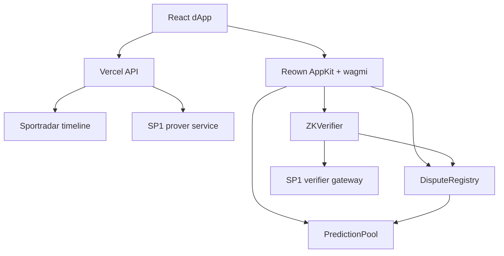

# ZK-VAR

ZK-VAR is a World Cup-themed prediction market and dispute resolution app deployed on X Layer mainnet. Users stake native OKB on referee-review outcomes, vote in related dispute reviews, and claim payouts or refunds after settlement.

The settlement path uses a real SP1 proof service. The app requests a proof from the configured prover, commits the source-data hash on-chain when needed, and submits the returned proof bytes and public values to `ZKVerifier.sol`.

## Hackathon Fit

- World Cup and VAR decision markets for X Cup.
- Native OKB settlement on X Layer mainnet.
- On-chain prediction pools, dispute voting, and claim flows.
- SP1 proof verification integrated through a deployed verifier contract.
- Production market data is read from X Layer contract state.

## Mainnet Deployment

| Contract | Address |
| --- | --- |
| `PredictionPool.sol` | `0x359ac1e8a0ce01b002ac4b85802a889ac4d35557` |
| `DisputeRegistry.sol` | `0x8a549cbc1447110a7ce5e4f77072cb80b8c240d4` |
| `ZKVerifier.sol` | `0xdd6df236a011c02c40d5a9674971bcd929f22958` |
| SP1 verifier gateway | `0xe624B37fA01d31322386a7D29580Adac82440A11` |
| SP1 Groth16 route | `0xc2223A25470562B57D27E5a10f8FbbB967941e6C` |

X Layer mainnet:

```text
Chain ID: 196
RPC URL: https://rpc.xlayer.tech
Fallback RPC URL: https://xlayerrpc.okx.com
Explorer: https://www.okx.com/web3/explorer/xlayer
Native token: OKB
```

SP1 program verification key:

```text
0x00a87127b8bbd6781347a09977e6f9820fcd942aab11c8e8881cf4075a71454e
```

## Architecture



## Contracts

### PredictionPool

- Creates prediction pools.
- Accepts native OKB stakes on outcome `1` or `2`.
- Resolves only through the linked `DisputeRegistry`.
- Handles payout and refund claims.

### DisputeRegistry

- Creates a dispute for a specific play and prediction pool.
- Accepts staked jury votes: valid, invalid, or inconclusive.
- Receives ZK settlement from `ZKVerifier`.
- Handles jury reward claims.

### ZKVerifier

- Stores committed play-data hashes.
- Verifies SP1 proof payloads through the configured verifier gateway.
- Calls `DisputeRegistry.resolveFromVerifier()` after successful proof verification.

## Frontend

The frontend reads active pools and disputes from X Layer contracts. Browser RPC reads are backed by `/api/markets`, a server-side read endpoint that returns the same on-chain fields without invented fallback records.

The default market set focuses on proven referee-review outcomes for Mexico vs South Africa, the 2026 opening match:

| Pool | Play | Proven outcome |
| --- | --- | --- |
| `1` | `101` | VAR-confirmed offside decision |
| `2` | `102` | Goal disallowed after VAR review |
| `3` | `103` | Penalty decision reviewed by VAR |
| `4` | `104` | Red-card VAR review |
| `5` | `105` | Two or more VAR reviews |

The dApp supports:

- Wallet connection through Reown AppKit.
- Prediction staking.
- Jury voting.
- Owner-only market deployment.
- Owner-only SP1 proof settlement.
- Claim center for wallet positions.
- Transaction history with OKX Explorer links.

## API Routes

### `POST /api/prove`

Inputs:

```json
{ "playId": 101 }
```

Flow:

1. Reads the configured Sportradar event mapping.
2. Fetches the timeline for the play.
3. Derives the referee-review verdict from source data.
4. Hashes the canonical source payload.
5. Requests proof bytes from `SP1_PROVER_URL`.
6. Returns `isOffside`, `dataHash`, `publicValues`, and `proofBytes`.

The route fails if the prover is not configured or does not return a valid proof response.

### `GET /api/markets`

Reads current pool and dispute records from X Layer mainnet. This endpoint is used as a resilient fallback when a browser RPC provider is unavailable.

## Environment Variables

### Vercel frontend and API

```env
VITE_REOWN_PROJECT_ID=your_reown_project_id
VITE_ZK_VERIFIER_ADDRESS=0xdd6df236a011c02c40d5a9674971bcd929f22958
VITE_DISPUTE_REGISTRY_ADDRESS=0x8a549cbc1447110a7ce5e4f77072cb80b8c240d4
VITE_PREDICTION_POOL_ADDRESS=0x359ac1e8a0ce01b002ac4b85802a889ac4d35557
VITE_HISTORY_START_BLOCK=61004981
VITE_HISTORY_LOOKBACK_BLOCKS=50000

SPORTRADAR_API_KEY=your_sportradar_key
SPORTRADAR_ACCESS_LEVEL=trial
SPORTRADAR_LANGUAGE=en
SPORTRADAR_FORMAT=json
SPORTRADAR_SPORT_EVENT_MAP={"101":"sr:sport_event:66456904","102":"sr:sport_event:66456904","103":"sr:sport_event:66456904","104":"sr:sport_event:66456904","105":"sr:sport_event:66456904"}
SP1_PROVER_URL=https://your-sp1-prover.example.com
```

### Local contract scripts

```env
PRIVATE_KEY=your_deployer_private_key
RPC_URL=https://rpc.xlayer.tech
RPC_FALLBACK_URL=https://xlayerrpc.okx.com
SP1_VERIFIER=0xe624B37fA01d31322386a7D29580Adac82440A11
SP1_PROGRAM_VKEY=0x00a87127b8bbd6781347a09977e6f9820fcd942aab11c8e8881cf4075a71454e
```

Do not add private keys to Vercel.

## Local Development

```bash
npm install
npm run dev
```

Build and lint:

```bash
npm run lint
npm run build
```

Foundry tests:

```bash
forge test
```

## Usage Flow

1. Connect a wallet on X Layer mainnet.
2. Open Markets and choose an active prediction pool.
3. Stake OKB on the selected outcome.
4. Open Tribunal and cast a staked jury vote if desired.
5. Wait for owner/oracle settlement through SP1 verification.
6. Claim payouts, refunds, or jury rewards from the Claim Center.

## Production Notes

- Production markets and disputes come from deployed X Layer contracts.
- Proof settlement requires a funded Succinct prover account.
- SP1 proof verification is owner/oracle restricted by contract permissions.
- Users keep custody of funds and sign all stake, vote, and claim transactions from their wallet.
